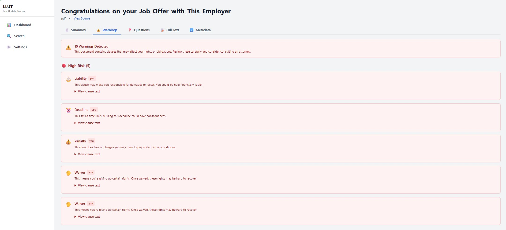
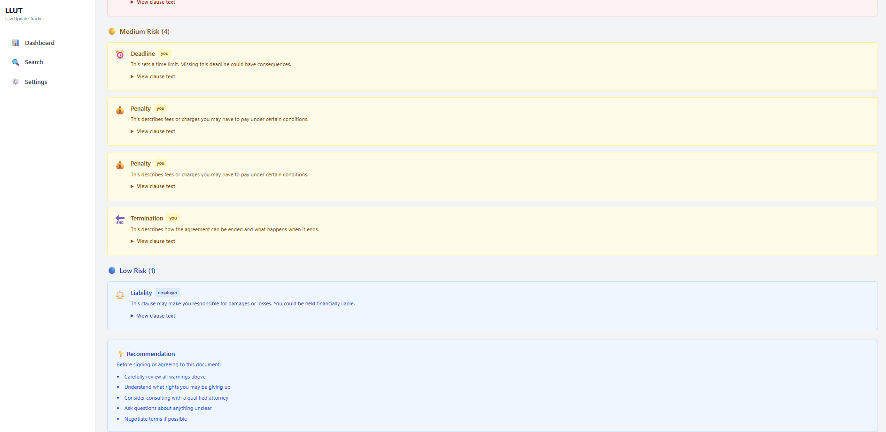

# LLUT - Local Law Update Tracker

A local-first desktop application that summarizes and analyzes Terms of Use, legal contracts, leases, and employment agreements, identifying risks, obligations, and conflicts with local ordinances.
It tracks legal recent updates from authoritative sources (including US Congress, Executive Orders, Supreme Court rulings, and selected international law sources) and automatically re-analyzes documents as laws and regulations change.
Please review the documentation for setup, data sources, and usage details.

## Screenshots

See LLUT in action:


_AI-powered document analysis with explainable confidence scoring, verified citations, and interactive citation chips_


_Categorized risk warnings (High/Medium/Low) with clickable citations that jump to source text_


_Expandable warnings with verified quotes, confidence reasons, and actionable recommendations_

## Features

- **Local-first:** All core features work without a cloud account
- **Authoritative sources:** Official government sources (Congress.gov, FederalRegister.gov, SupremeCourt.gov, GovInfo)
- **User document uploads:** Upload and analyze your own PDFs, DOCX, TXT, and HTML documents
- **AI-powered analysis:** Plain-language summaries, risk warnings, and questions for legal professionals
- **Trust Engine:** Citation verification with fuzzy matching and explainable confidence scoring
  - Verified citations with exact/fuzzy match detection
  - Deterministic confidence scores (0-100%) with detailed reasons
  - Clickable citations that jump to source text with highlighting
  - Warnings for unverified citations and low-confidence analyses
- **Smart storage:** Three storage modes (Full Offline, Thin Cache, Metadata Only) to control disk usage
- **Full-text search:** Fast SQLite FTS5 search across all downloaded documents and uploads
- **Version tracking:** Automatic detection and diffing of document changes
- **Plain-language summaries:** Understand complex legal documents in everyday language
- **Interactive UX:** Click citations to jump to source text with smooth scrolling and highlighting
- **Performance optimized:** React Query caching, memoized rendering, and loading skeletons for instant feel
- **Privacy-focused:** No data uploads, all processing happens locally

## Tech Stack

- **Desktop:** Tauri + React
- **Backend:** Python 3.11+ FastAPI (runs locally)
- **Database:** SQLite with FTS5 full-text search
- **Packaging:** Cross-platform installers (Windows, macOS, Linux)

## Quick Start

> **New to LLUT?** Check out [QUICKSTART.md](QUICKSTART.md) for the easiest way to get started with the `./llut.sh` all-in-one script!

### Prerequisites

- Python 3.11 or higher
- Node.js (LTS version recommended)
- Rust and Cargo (for Tauri builds)
- Git (for version control)
- Git Bash (Windows users)

### Installation

```bash
# Clone the repository
git clone https://github.com/sekacorn/Local-Law-Update-Tracker.git
cd Local-Law-Update-Tracker

# Install all dependencies
make install
```

### Development

**Option 1: Using the all-in-one script (Recommended)**

```bash
# Start the application
./llut.sh

# Stop the application
./llut.sh --stop

# Stop and clear cache
./llut.sh --stop --clean

# Restart the application
./llut.sh --restart

# Check status
./llut.sh --status

# View logs
./llut.sh --logs
```

**Option 2: Using Makefile**

```bash
# Start development environment (backend + frontend)
make dev

# In another terminal, stop all processes
make stop
```

### Building

```bash
# Build production desktop application
make build

# Start the built application
make start
```

### Maintenance

```bash
# Clean temporary files and build artifacts
make clean

# Reset local database (WARNING: deletes all data)
make reset

# Run tests
make test
```

## Windows Users

You have three options:

**Option 1: llut.sh (Recommended - Git Bash)**

```bash
# Start the app
bash llut.sh

# Stop the app
bash llut.sh --stop

# Stop and clear cache
bash llut.sh -s -c
```

**Option 2: Windows Batch File**

```cmd
REM Using batch file
llut.bat help
llut.bat dev
llut.bat build
llut.bat stop
llut.bat clean
```

**Option 3: Makefile (Git Bash)**

```bash
make dev
make build
make stop
```

## Project Structure

```
llut/
├── README.md                      # This file
├── LLUT_DesignDoc.txt # Complete design specification
├── Makefile                       # Build automation
├── llut.bat                       # Windows batch wrapper
├── apps/
│   └── desktop/                   # Tauri + React frontend
│       ├── src/                   # React source code
│       │   ├── components/        # React components
│       │   │   ├── CitationChip.tsx         # Clickable citation chips
│       │   │   ├── ConfidencePanel.tsx      # Confidence display
│       │   │   ├── LoadingSkeleton.tsx      # Loading states
│       │   │   ├── SummaryTab.tsx           # Summary view
│       │   │   ├── WarningsTab.tsx          # Warnings view
│       │   │   └── QuestionsTab.tsx         # Questions checklist
│       │   ├── pages/             # Page components
│       │   │   └── DocumentViewer.tsx       # Document viewer with highlighting
│       │   └── lib/
│       │       └── api.ts         # API client
│       └── src-tauri/             # Tauri Rust code
├── backend/
│   ├── app/
│   │   ├── main.py               # FastAPI server
│   │   ├── db.py                 # Database management
│   │   ├── settings.py           # Configuration
│   │   ├── connectors/           # Source connectors
│   │   │   ├── congress_gov.py
│   │   │   ├── govinfo.py
│   │   │   ├── federal_register.py
│   │   │   ├── scotus.py
│   │   │   └── user_uploads.py  # User uploads connector
│   │   ├── parsers/              # Document parsers
│   │   │   ├── pdf_parser.py
│   │   │   ├── html_parser.py
│   │   │   ├── normalizer.py
│   │   │   └── document_parser.py # Multi-format parser (PDF/DOCX/TXT/HTML)
│   │   ├── analysis/             # AI analysis
│   │   │   ├── citations.py     # Citation verification & Trust Engine
│   │   │   └── policy_analyzer.py # Policy analysis
│   │   └── routers/              # API endpoints
│   │       ├── uploads.py       # Upload API
│   │       └── summary.py       # Summary & analysis API
│   └── tests/                    # Backend tests
│       ├── test_citations.py    # Citation verification tests
│       ├── test_db.py           # Database tests
│       └── test_parsers.py      # Parser tests
├── scripts/
│   ├── README.md                 # Detailed script documentation
│   ├── dev_run.sh               # Start development environment
│   ├── build_desktop.sh         # Build production app
│   ├── start_app.sh             # Start built app
│   ├── stop_all.sh              # Stop all processes
│   ├── cleanup.sh               # Clean temp files
│   └── reset_db.sh              # Reset database
└── app_data/                     # Runtime data (created automatically)
    ├── llut.db                   # SQLite database
    ├── cache/                    # Cached files
    ├── uploads/                  # User uploaded documents
    └── settings.json             # User settings
```

## Available Commands

### llut.sh Script (All-in-One - Recommended)

| Command                       | Description                                |
| ----------------------------- | ------------------------------------------ |
| `./llut.sh`                   | Start the application (backend + frontend) |
| `./llut.sh --stop` or `-s`    | Stop the application                       |
| `./llut.sh --clean` or `-c`   | Clear all cache files                      |
| `./llut.sh --restart` or `-r` | Restart the application                    |
| `./llut.sh --stop --clean`    | Stop and clear cache (combined)            |
| `./llut.sh --status`          | Show application status                    |
| `./llut.sh --logs`            | Show recent logs                           |
| `./llut.sh --help`            | Show help message                          |

> See [QUICKSTART.md](QUICKSTART.md) for detailed usage examples

### Makefile Commands

| Command        | Description                                  |
| -------------- | -------------------------------------------- |
| `make help`    | Show all available commands                  |
| `make install` | Install all dependencies                     |
| `make dev`     | Start development servers                    |
| `make build`   | Build production desktop application         |
| `make start`   | Start the built application                  |
| `make stop`    | Stop all running processes                   |
| `make clean`   | Clean temporary files and build artifacts    |
| `make reset`   | Reset local database (WARNING: deletes data) |
| `make test`    | Run all tests                                |

### Script Details

For detailed information about each script, see [scripts/README.md](scripts/README.md).

## Storage Modes

LLUT offers three storage modes to balance functionality and disk usage:

### Full Offline (Default)

- Stores complete document text and raw files locally
- Works entirely offline once synced
- Best for: Regular users, offline work, comprehensive search

### Thin Cache

- Stores metadata, outlines, and snippets only
- Downloads full text on-demand when needed
- Best for: Limited disk space, selective document access

### Metadata Only

- Stores only metadata and URLs
- All content retrieved on-demand (requires internet)
- Best for: Minimal storage, online-only usage

You can switch modes anytime in Settings.

## Data Sources (MVP)

1. **Congress.gov** - Bills, versions, and legislative actions
2. **GovInfo** - GPO published documents
3. **FederalRegister.gov** - Rules and Executive Orders
4. **SupremeCourt.gov** - Supreme Court opinions

## Key Features

### Document Tracking

- Automatic sync of new documents and versions
- Change detection and notifications
- Version history and diffing

### Search

- Full-text search with FTS5
- Filter by source, type, date, jurisdiction
- Citation extraction and linking

### Plain-Language Summaries

- Layperson-friendly explanations
- Use-case specific summaries (home buying, job/HR, etc.)
- Liability and risk warnings
- "Questions to ask a professional" checklists

### Trust Engine (Citation Verification)

LLUT's Trust Engine ensures all analysis is backed by verifiable citations with explainable confidence scoring:

**Citation Verification:**

- **Exact Match Detection:** Finds citations at exact character positions in normalized text
- **Fuzzy Matching Fallback:** Uses similarity matching (≥85% threshold) when text varies slightly
- **Verification Flags:** Every citation marked as `verified=true/false`
- **Match Methods:** Tracks whether citation was found via "exact", "fuzzy", or "none"

**Deterministic Confidence Scoring (0.0-1.0):**

The confidence score is calculated using a transparent formula:

```
Score = (Verification + Match + Metadata) × Parser Weight + Bonus

Factors:
a) Verification Status:
   - verified=true: +0.4
   - verified=false: -0.3

b) Match Method:
   - exact: +0.2
   - fuzzy: +0.1
   - none: -0.2

c) Parser Reliability Weight:
   - TXT: 1.0 (most reliable)
   - HTML: 0.95
   - DOCX: 0.9
   - PDF: 0.75
   - Unknown: 0.5

d) Structure Metadata:
   - Section heading: +0.1
   - Page number: +0.1
   - Adequate text length: +0.1

e) Verification Bonus:
   - +0.02 per verified citation (max +0.1)
```

**Explainable Confidence Reasons:**

Every score includes human-readable reasons:

- "Citation verified in source text"
- "Exact match found at claimed position"
- "High parser reliability (text/html)"
- "WARNING: Citation could not be verified"
- "WARNING: Moderate parser reliability (PDF)"

**Database Persistence:**

- Citations stored in `citation_span` table
- Includes: `document_id`, `version_id`, `quote_text`, `verified`, `match_method`, `confidence`
- Character offsets: `start_char`, `end_char` for precise location
- Metadata: `heading`, `page_number` when available

**API Response Enhancement:**

```json
{
  "grounding": {
    "confidence": 0.85,
    "confidence_reasons": ["Citation verified...", "Exact match..."],
    "verified_count": 15,
    "exact_matches": 14,
    "fuzzy_matches": 1
  },
  "citations": [{
    "verified": true,
    "match_method": "exact",
    "confidence": 0.9,
    "quote_text": "Tenant shall pay...",
    "location": {
      "section": "Section 4. Rent",
      "char_start": 1250,
      "char_end": 1320
    }
  }]
}
```

**Testing:**

- 14 unit tests covering verification, fuzzy matching, and confidence scoring
- All tests passing with deterministic results
- Fixtures for TXT, HTML, and document extraction

### User Uploads

Upload and analyze your own documents with AI-powered insights:

**Supported Formats:**

- PDF documents
- Word documents (DOCX)
- Text files (TXT)
- HTML files

**Analysis Features:**

- **Plain-Language Summary:** Understand what your document means in everyday language
- **Risk Warnings:** Identify liability clauses, deadlines, penalties, and hidden risks
  - Categorized by severity (High/Medium/Low)
  - Clear explanations of who's affected and why it matters
- **Questions for Professionals:** AI-generated checklist of questions to ask your lawyer
- **Citation Grounding with Trust Engine:**
  - All analysis backed by verified quotes from your document
  - Explainable confidence scoring (0-100%) with detailed reasons
  - Clickable citations that jump to source text with highlighting
  - Visual warnings for unverified citations (red chips)
  - Low-confidence banner when score < 50%
  - Page/section references with exact character offsets
  - Only generates summaries when confidence ≥ 50%

**Interactive UX:**

- **CitationChip Component:** Clickable chips with hover tooltips
  - Blue chips for verified citations (exact match)
  - Red chips for unverified citations
  - Yellow chips for low-confidence citations
  - Approximately equal symbol for fuzzy-matched citations
  - Tooltip shows: confidence %, match method, location, quote preview
- **Jump to Citation:** Click chip → switches to Full Text tab → highlights text → scrolls into view
- **ConfidencePanel:** Expandable accordion with all confidence factors
- **Loading Skeletons:** Smooth loading states for instant feel

**Performance Optimizations:**

- React Query caching (10 min stale, 1 hour cache)
- Memoized document rendering (no re-renders on tab switch)
- Keep previous data to prevent loading flashes
- ~90% reduction in API calls

**Performance Metrics:**
| Metric                 | Before            | After               | Improvement        |
|------------------------|-------------------|---------------------|--------------------|
| **Tab Switch Time**    | ~500ms            | <50ms               | **10x faster**     |
| **API Calls**          | Every tab switch  | Cached 10 min       | **90% reduction**  |
| **Perceived Load Time**| Blank screen      | Skeleton → Content  | **Feels instant**  |
| **Re-renders**         | Every tab change  | Memoized            | **Eliminated jank**|


**Features:**

- Drag & drop upload
- File size up to 50MB
- Automatic text extraction and parsing
- Full-text search integration
- Storage management (view usage, clear all uploads)
- Pin important documents for persistent storage

**Privacy:**

- All analysis happens locally
- No cloud uploads or external API calls
- Documents stored in `app_data/uploads/`
- Delete anytime from Settings page

> See [USER_UPLOADS_COMPLETE.md](USER_UPLOADS_COMPLETE.md) for detailed documentation

### Data Management

- Pin important documents to keep locally
- Configurable cache retention
- One-click database reset
- Import/export capabilities
- User uploads storage management

## Development Workflow

### First-time setup

```bash
make install  # Install all dependencies
make dev      # Start development environment
```

### Daily development

```bash
make dev      # Start dev servers
# ... make changes ...
make stop     # Stop when done
```

### Before committing

```bash
make test     # Run tests
make clean    # Clean artifacts
```

### Preparing a release

```bash
make clean    # Clean old builds
make build    # Build production app
make start    # Test the build
```

## Testing

Run tests with:

```bash
make test

# Or run specific test suites
cd backend
pytest tests/test_citations.py -v    # Citation verification (14 tests)
pytest tests/test_db.py -v           # Database operations
pytest tests/test_connectors.py      # Data source connectors
pytest tests/test_parsers.py         # Document parsers
```

**Citation Verification Tests** (14 passing tests):

- Exact match at claimed position
- Exact match at different position (search)
- Fuzzy matching with 85% threshold
- Case-insensitive matching
- Unverified citation handling
- High confidence scoring (verified + exact + TXT)
- Low confidence scoring (unverified)
- Medium confidence scoring (fuzzy + PDF)
- Deterministic confidence (same inputs = same outputs)
- All factors contribute to score
- Full citation extraction from TXT
- Full citation extraction from HTML
- Overall confidence calculation
- Citation dataclass serialization

## Logging

Development logs are written to:

- `backend.log` - FastAPI server output
- `frontend.log` - Tauri/React output

View in real-time:

```bash
tail -f backend.log
tail -f frontend.log
```

## Troubleshooting

### Backend won't start

```bash
cat backend.log              # Check for errors
python --version             # Verify Python 3.11+
make install                 # Reinstall dependencies
```

### Frontend won't start

```bash
cat frontend.log             # Check for errors
node --version               # Verify Node.js installed
cd apps/desktop && npm install  # Reinstall modules
```

### Build fails

```bash
make clean                   # Clean everything
cargo --version              # Verify Rust installed
make build                   # Try again
```

### Can't stop processes

```bash
make stop                    # Try normal stop
pkill -f uvicorn            # Manual backend kill
pkill -f "tauri dev"        # Manual frontend kill
```

## Security & Privacy

- All data stored locally (no cloud uploads)
- API keys stored in OS keychain (when available)
- Optional export redaction
- Open source (audit the code yourself)

## Legal Disclaimer

**This application is NOT legal advice.** LLUT is a research and informational tool. All summaries, explanations, and warnings are educational only. Always consult qualified legal professionals for legal advice specific to your situation.

## Contributing

Contributions are welcome! Please feel free to submit a Pull Request. For major changes, please open an issue first to discuss what you would like to change.

## License

LLUT is available under a **dual-license model**. You choose which license works best for your use case:

### Option 1: AGPL-3.0-or-later (Free & Open Source)

Perfect for individuals, nonprofits, researchers, and organizations committed to open source.

**You can freely:**

- Use LLUT for personal or organizational purposes
- Modify and customize LLUT for your needs
- Distribute LLUT to others
- Run LLUT as a network service

**Requirements:**

- If you modify LLUT and offer it as a network service (including SaaS), you must make your source code available to users
- Derivative works must also be licensed under AGPL-3.0-or-later
- Preserve copyright and license notices

**No Warranty**: The software is provided "as is" without warranties of any kind.

### Option 2: Commercial License (Paid)

Perfect for businesses that want to use LLUT in closed-source products or SaaS offerings.

**You can:**

- Use LLUT in closed-source/proprietary applications
- Make proprietary modifications without disclosure
- Offer LLUT as a SaaS/hosted service without sharing source code
- Integrate LLUT into commercial products
- Receive patent grants and protections

**Contact**: sekacorn@gmail.com for commercial licensing inquiries

### Which License Should I Choose?

- **For personal use, nonprofits, or open source projects**: Use AGPL (free)
- **For commercial SaaS or closed-source products**: Get a Commercial License (paid)
- **Not sure?** See [LICENSE-OVERVIEW.md](LICENSE-OVERVIEW.md) for detailed guidance

### License Files

- [LICENSE](LICENSE) - Dual-license notice and AGPL reference
- [LICENSE-OVERVIEW.md](LICENSE-OVERVIEW.md) - Plain English explanation of both licenses
- [LICENSE-COMMERCIAL.md](LICENSE-COMMERCIAL.md) - Full commercial license terms
- [LICENSE-HEADER.txt](LICENSE-HEADER.txt) - Source file header template

## Documentation

- [Design Document] Complete technical specification
- [User Uploads Complete](USER_UPLOADS_COMPLETE.md) - User uploads feature documentation
- [Phase 6 Complete](PHASE_6_COMPLETE.md) - Frontend upload UI details
- [Phase 7 Complete](PHASE_7_COMPLETE.md) - Enhanced document viewer details
- [Scripts README](scripts/README.md) - Detailed script documentation
- API Documentation - (To be generated)

## Roadmap

### Phase 1 - MVP [COMPLETE]

- [x] Project structure and scripts
- [x] Database schema and migrations
- [x] FastAPI backend with health endpoint
- [x] Settings management
- [x] Database reset functionality

### Phase 2 - Data Management [COMPLETE]

- [x] Database schema with FTS5 search
- [x] Migration system
- [x] Sync orchestration
- [x] Settings management

### Phase 3 - First Connector [COMPLETE]

- [x] Federal Register connector (TESTED with live data)
- [x] Full-text search functionality
- [x] Document fetching and storage

### Phase 4 - Additional Connectors [COMPLETE]

- [x] Congress.gov connector (needs API key for testing)
- [x] GovInfo connector (needs API key for testing)
- [x] SCOTUS connector (needs testing)
- [x] All 4 connectors implemented

### Phase 5 - Document Viewer + Diff [COMPLETE]

- [x] Document version viewer API
- [x] Diff engine (text, section, smart diff)
- [x] Version comparison endpoints
- [ ] Frontend UI (pending)

### Phase 6 - Storage Modes [SKIPPED for MVP]

- [ ] Thin cache mode
- [ ] On-demand fetching
- [ ] Document pinning

### Phase 7 - Plain-Language Summaries [COMPLETE]

- [x] Legal jargon simplification (20+ terms)
- [x] Risk/liability detection (8 categories)
- [x] Questions for professionals
- [x] Section explanation
- [x] Summary API endpoints

### Phase 8 - User Uploads Feature [COMPLETE]

- [x] Multi-format document parsing (PDF, DOCX, TXT, HTML)
- [x] Upload API endpoints (8 endpoints)
- [x] Citation extraction with grounding
- [x] Confidence scoring system (0.0-1.0)
- [x] Frontend upload UI with drag & drop
- [x] Enhanced document viewer (Summary/Warnings/Questions tabs)
- [x] Search integration with upload filtering
- [x] Storage management UI
- [x] Pin/unpin functionality
- [x] Clear all uploads feature
- [x] **Trust Engine Implementation** (Agent 1)
  - [x] Citation verification with exact/fuzzy matching
  - [x] Deterministic confidence scoring with explainable reasons
  - [x] Database schema enhancement (Migration 005)
  - [x] Citation span persistence
  - [x] Enhanced API responses with verification metadata
  - [x] 14 passing unit tests for citation verification
- [x] **Speed + UX Improvements** (Agent 2)
  - [x] CitationChip component with clickable citations
  - [x] Document text highlighting with jump-to-citation
  - [x] ConfidencePanel with expandable reasons
  - [x] Low-confidence banner for <50% scores
  - [x] React Query caching optimizations
  - [x] Loading skeletons for all tabs
  - [x] Memoized rendering for performance

### Phase 9 - Tauri Desktop Packaging [CONFIGURED]

- [x] Tauri configuration
- [x] Backend sidecar scripts (Windows/macOS/Linux)
- [x] Build scripts and documentation
- [ ] Rust installation and build testing
- [ ] Production installers

### Phase 10 - Frontend & Polish [COMPLETE]

- [x] React UI components
- [x] API integration
- [x] Routing and navigation
- [x] State management
- [x] Interactive citation UX with clickable chips
- [x] Document highlighting and jump-to-citation
- [x] Confidence visualization with expandable details
- [x] Performance optimization (caching, memoization, skeletons)
- [ ] Comprehensive end-to-end tests
- [ ] Accessibility audit

## Support

For issues, questions, or suggestions:

- GitHub Issues: (To be created)

---

**Built with:** Tauri, React, FastAPI, SQLite
**Version:** 0.3.0 (Trust Engine + Speed UX Complete!)
**Last updated:** 2026-02-06

**Latest Enhancements:**

- Trust Engine: Citation verification with fuzzy matching
- Explainable confidence scoring with detailed reasons
- Interactive UX: Clickable citations with highlighting
- Performance: React Query caching + memoization
- 14 passing unit tests for citation verification
